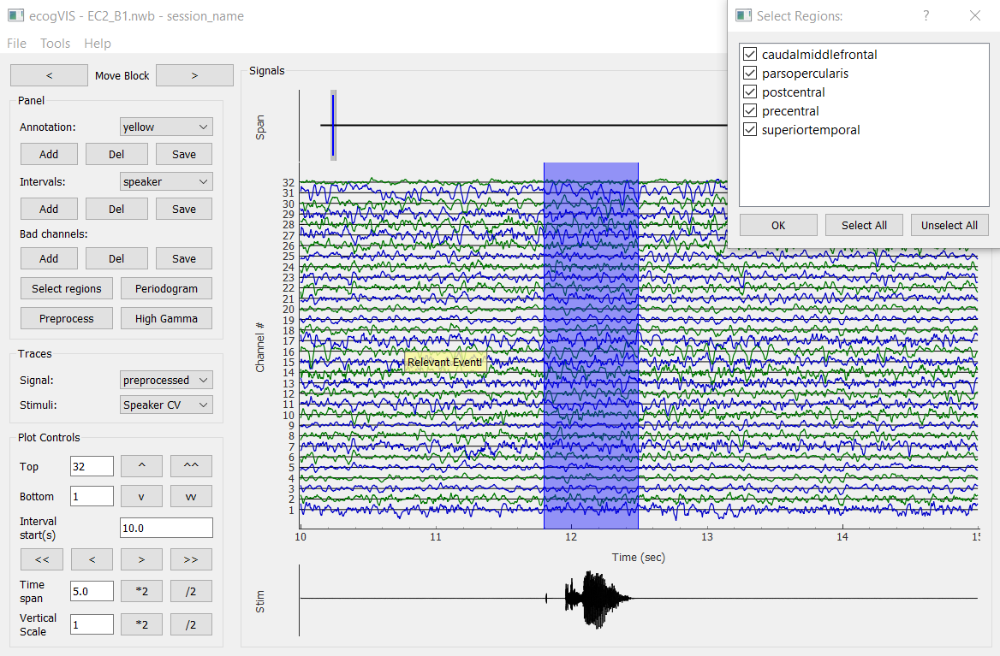
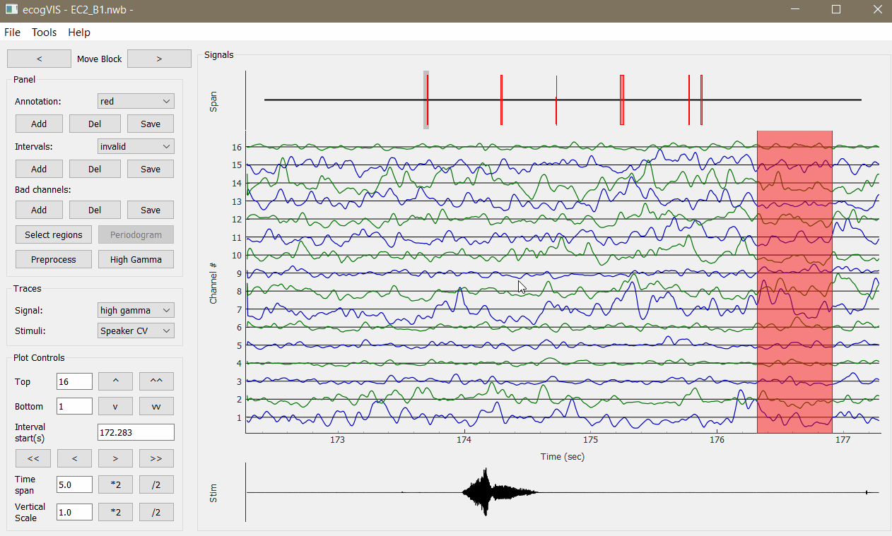
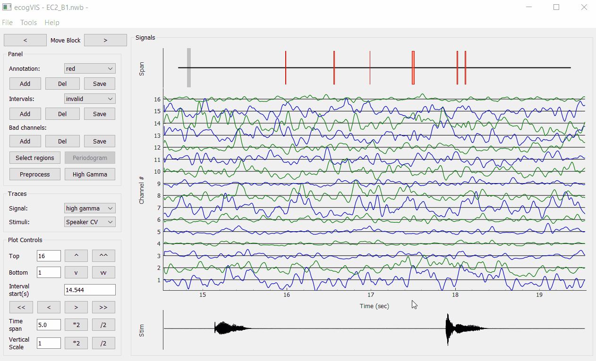
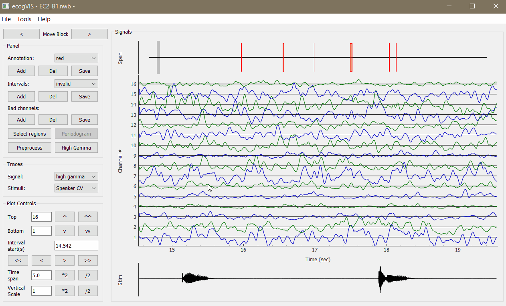
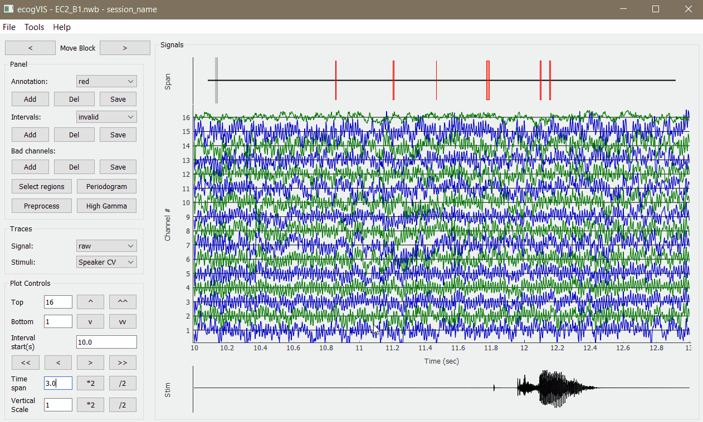
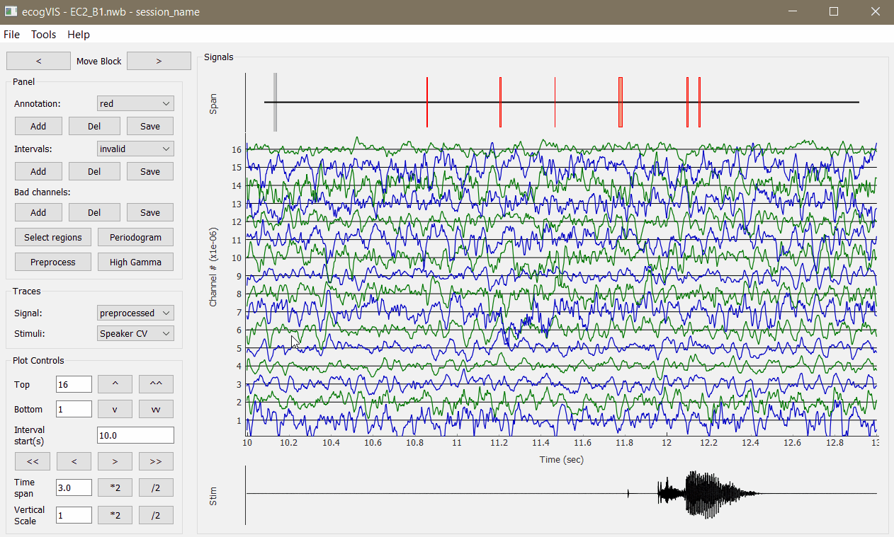
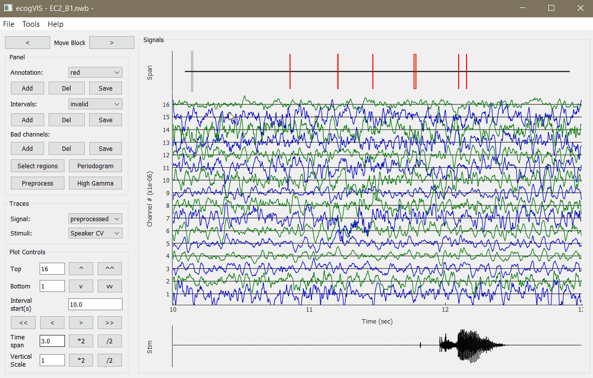
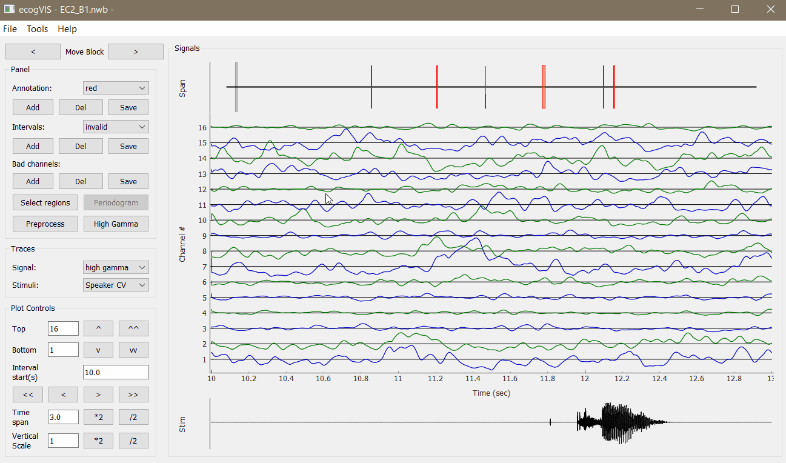

# ecogVIS
Timeseries visualizer and data processing tools for Electrocorticography (ECoG) signals stored in [NWB](https://neurodatawithoutborders.github.io/) files, for Python.

A collaboration with with [Chang Lab](http://changlab.ucsf.edu/).



## Installation
To clone the repository and set up a conda environment, do:
```
$ git clone https://github.com/ben-dichter-consulting/ecogVIS
$ conda env create -f ecogVIS/make_env.yml
$ source activate ecog_vis
```

Alternatively, to install **ecogVIS** directly in an existing environment:
```
$ pip install git+https://github.com/ben-dichter-consulting/ecogVIS
```

After activating the correct environment, **ecogVIS** can be imported and run from python. If the file does not exist (or if you provide an empty string ''), you'll be prompted to choose a file from a dialog.
```python
from ecogvis.ecogvis import main
import os

fpath = os.path.join('path_to','file.nwb')
main(fpath)
```


## Features
**ecogVIS** makes it intuitive and simple to viualize and process ECoG signals. It currently features:

<details>
  <summary> 
    <strong>Navigation</strong> 
  </summary>
  Seamless visual navigation through long signals from large arrays of electrodes, by mouse-dragging visualization window, control buttons, value fields and keyboard keys. <br></br>

  

  
</details>

<details>
  <summary> 
    <strong>Annotations</strong> 
  </summary>
  Add, delete, save and load annotations for meaningful comments anywhere in the visualization. <br></br>

  
</details>

<details>
  <summary> 
    <strong>Intervals</strong> 
  </summary>
  Add, delete, save, load and create custom intervals types to mark specific points in time, with simple click-drag-release mouse movements. <br></br>

  
</details>

<details>
  <summary> 
    <strong>Bad Channels</strong> 
  </summary>
  Mark and un-mark bad channels. Choices are saved in the <em>electrodes</em> group of the current NWB file. <br></br>

  
</details>

<details>
  <summary> 
    <strong>Signal preprocessing</strong> 
  </summary>
  Preprocessing of raw voltage signals, including user-defined Downsampling, CAR and Notch filtering. The resulting processed signals are stored as an <a href="https://pynwb.readthedocs.io/en/stable/pynwb.ecephys.html#pynwb.ecephys.LFP">LFP</a> object, in the <em>processing</em> group of the current NWB file. <br></br>

  
</details>

<details>
  <summary> 
    <strong>Events detection</strong> 
  </summary>
  Automatic detection of events in audio recordings for Consonant-Vowel tasks. The audio data should be stored in the NWB file in the following way:
  <ul>
    <li>Speaker audio - As a <a href="https://pynwb.readthedocs.io/en/stable/pynwb.base.html#pynwb.base.TimeSeries">TimeSeries</a> object, named 'Speaker CV', in the <em>stimulus</em> group.</li>
    <li>Microphone audio - As a <a href="https://pynwb.readthedocs.io/en/stable/pynwb.base.html#pynwb.base.TimeSeries">TimeSeries</a>  object, named 'Microphone CV', in the <em>acquisition</em> group.
</li>
  </ul> 
  The resulting detected intervals, 'TimeIntervals_mic' and 'TimeIntervals_speaker', are saved as <a href="https://pynwb.readthedocs.io/en/stable/pynwb.epoch.html#pynwb.epoch.TimeIntervals">TimeIntervals</a> objects in the <em>intervals</em> group of the current NWB file and can be used later for ERP analysis. A preview allows for testing of the detection parameters before running it for the whole duration of the audio signals. <br></br>

  
</details>

<details>
  <summary> 
    <strong>High Gamma</strong> 
  </summary>
  Estimation of high gamma analytic amplitude, with the average of user-defined specific bands. The results are saved as a <a href="https://pynwb.readthedocs.io/en/stable/pynwb.base.html#pynwb.base.TimeSeries">TimeSeries</a> object, named 'high_gamma', in the <em>processing</em> group of the current or of a new NWB file. <br></br>

  
</details>

<details>
  <summary> 
    <strong>Event-Related Potentials</strong> 
  </summary>
  Grid visualization of high gamma ERP calculated in reference to:
  <ul>
    <li>Stimulus (speaker) or response (microphone) time intervals</li>
    <li>Onset or offset points</li>
  </ul> 
  The grid items are coloured to mark specific cortical areas and can be rotated to correspond anatomically to them. Emphasis can be given to specific areas of interest and double-clicking an item allows for fast inspection of the single electrode's ERP in detail. <br></br>
  
  
</details>

<details>
  <summary> 
    <strong>Periodograms</strong> 
  </summary>
  Grid visualization of Periodograms:
  <ul>
    <li>Raw and preprocessed data</li>
    <li>FFT and Welch methods</li>
    <li>Individual devices</li>
  </ul> 
  The grid items are coloured to mark specific cortical areas and can be rotated to correspond anatomically to them. Emphasis can be given to specific areas of interest and double-clicking an item allows for fast inspection of the single electrode's Periodogram in detail. <br></br>
  
  
</details>

<details>
  <summary> 
    <strong>Spectral Decomposition</strong> 
  </summary>
  Analytic signal amplitude estimation by Hilbert transform of user-defined frequency bands. <br></br>
  WARNING: This function will manipulate an array of size (nSamples, nChannels, nBands), which might be in the order of gigabytes and demand a large memory to operate and is likely to produce a large file. <br></br>
  
  
</details>

### Plus
- Select electrodes from specific brain areas
- Easy moving between block files for the same subject
